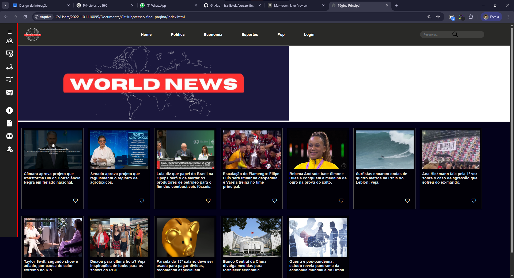
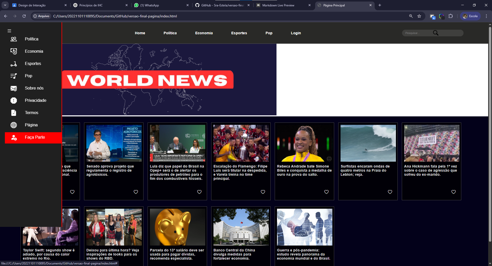
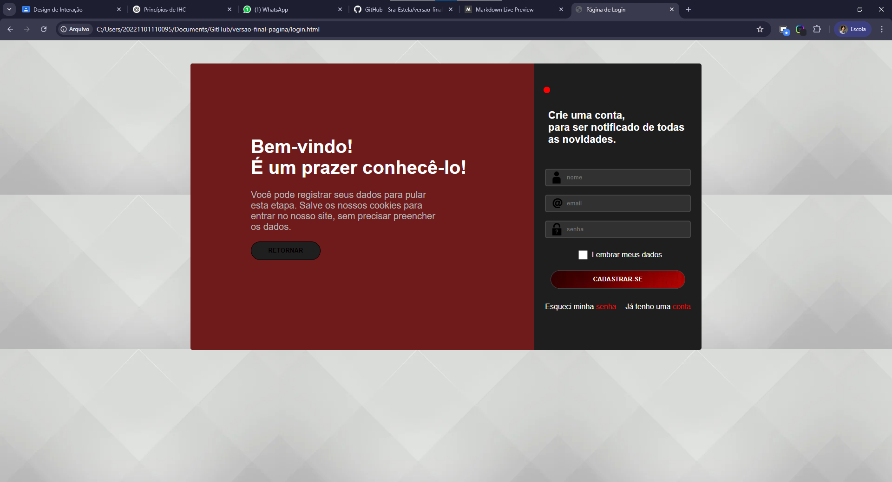

## 💻📚✨**Análise de Projetos (Projeto de Interface de Usuário)**
---
 

## **Propostas:**

### **Atividade 01**

> Escolha um princípio de interação e descreva um mau exemplo de um sito ou um aplicativo. **Obs.: Colocar prints.**

### **Atividade 02**

> Considerando os princípios de interface, faça uma análise crítica de um site, pode ser apenas da página inicial.

---

 

## O que são princípios de interação e quais existem?

#### São princípios baseados nas interações humano-computador (IHC), eles são: "Visibilidade", "Feedback", "Restrições", "Mapeamento", "Consistência" e "Affoerdence e Significantes".

 

| Interações | Significado |
| :----------- |:--------------|
| ► Visibilidade    | 📘 1. Visibilidade Refere-se à facilidade com que o usuário percebe o que pode ser feito em uma interface. Os elementos interativos (como botões, menus, ícones) devem estar visíveis e intuitivos. ➡ Exemplo: Um botão “Salvar” bem destacado no topo de um formulário.     |
| ► Feedback        | 📘 2. Feedback É a resposta imediata do sistema a uma ação do usuário, indicando que algo foi feito ou está sendo processado. ➡ Exemplo: Um som ao enviar uma mensagem, uma barra de progresso ao fazer upload de um arquivo.     |
| ► Restrições      | 📘 3. Restrições São limitações intencionais para evitar erros e orientar o comportamento do usuário. Podem ser físicas, lógicas ou culturais. ➡ Exemplo: Um botão “Enviar” que só habilita após preencher todos os campos obrigatórios.     |
| ► Mapeamento      | 📘 4. Mapeamento Relaciona-se à associação clara entre controles e seus efeitos. Um bom mapeamento faz com que o usuário compreenda facilmente o que acontecerá ao interagir com algo. ➡ Exemplo: As setas de um teclado controlando o movimento em um jogo.     |
| ► Consistência    | 📘 5. Consistência É a manutenção de padrões e comportamentos previsíveis em toda a interface. Isso reduz a curva de aprendizado e evita confusões. ➡ Exemplo: Usar o mesmo ícone de "lixeira" para "excluir" em todas as partes do sistema.     |
| ► Affordance e Significantes    |   📘 6. Affordance e Significantes > Affordance: indica as propriedades de um objeto que sugerem como ele pode ser usado.> Significantes: são pistas visuais, sonoras ou táteis que indicam como a interação deve ocorrer. ➡ Exemplo: Um botão com aparência tridimensional (affordance) e rótulo "Clique aqui" (significante).   |

---

 

## Aplicações que serão analisadas:
### 1. Repositório: `projeto_de_bd`
> Link da aplicação [Sistema de Controle de Estoque para uma Distribuidora](https://github.com/Sra-Estela/projeto_de_bd).

 

### 2. Repositório: `versao-final-pagina`
> Link da aplicação [Site para a disciplina de Design](https://github.com/Sra-Estela/versao-final-pagina).

 

### 3. Repositório: `projeto_design_web`
> Link da aplicação [Site de Culinária](https://github.com/Sra-Estela/projeto_design_web).

 

---

 

## Atividade 1:
### Princípios escolhidos "Visibilidade" e "Affordance e Significantes".

 

### **1. Aplicação `Sistema de Controle de Estoque para uma Distribuidora`:**
 

### **Página `Home`**:
 

 

### **Página `Cadastro de Produtos`**:
 

 

<!-- ### **Página `Registrar Movimentação`**:
 

 

### **Página `Relatório dos Registros`**:
 

 -->

---
 

### **2. Aplicação `Site para a disciplina de Design`:**
### **Página `Home`**:
 

 

### **Página `Home - Deashboard`**:
 

 

### **Página `Login/Cadastro`**:
 

---
 

### **3. Aplicação `Site de Culinária`:**
### **Página `Home`**:
 

 

#### Vídeo geral de todas as páginas:
> [Assista ao vídeo](./imgs/imgs_projeto_design_web/Mesa%26Arte%20-%20Google%20Chrome%202025-07-16%2011-05-12.mp4)

---